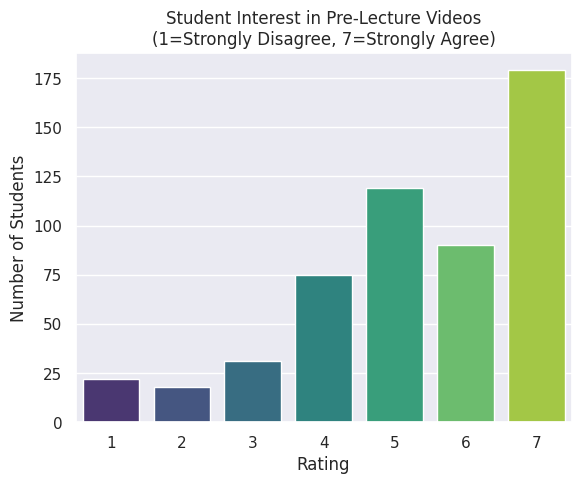
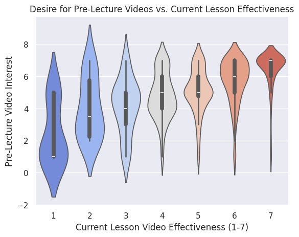

## Project Summary
This project analyzes survey data from COMP110 students to evaluate whether 
pre-lecture videos would be a valuable addition to the course. Using student 
responses on understanding, lesson effectiveness, and interest in pre-lecture 
videos, the goal was to determine if supplemental videos could help students 
better grasp course material.

## Analysis & Visualizations

Students were asked to rate their interest in pre-lecture videos on a 1–7 scale. 
The bar chart below shows the distribution of responses across all surveyed students.

The box plot compares students' interest in pre-lecture videos against their 
self-reported understanding of course material, revealing whether struggling 
students desire more supplemental resources.

The violin plot visualizes the density of interest in pre-lecture videos across 
varying levels of lesson video effectiveness, showing how students who find 
current lessons less effective respond to the idea of pre-lecture content.

## Conclusions
The data supports the addition of pre-lecture videos to COMP110. Students with 
lower understanding scores (≤ 3) showed notably higher interest in pre-lecture 
videos (≥ 5), and the majority of all students rated their interest at a 5 or 
higher. While producing videos would require significant time from the 
instructional team, the potential benefit to struggling students justifies the 
effort. A future study comparing quiz scores between semesters with and without 
pre-lecture videos could confirm whether the videos meaningfully improve student 
outcomes.
