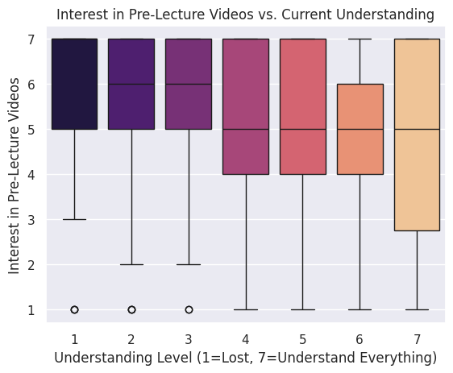

## Project Summary
COMP110 is a course taken by students across virtually every major at UNC, 
meaning the range of prior coding experience in any given semester is enormous. 
Some students come in having written code for years, while others have never 
seen a line of Python in their life. This project explores whether adding 
pre-lecture videos to the course would help bridge that gap — specifically for 
students who find themselves lost or falling behind. Using survey data collected 
from COMP110 students, I analyzed responses around self-reported understanding, 
lesson effectiveness, and direct interest in pre-lecture videos to see if the 
data makes a case for this addition.

## Analysis & Visualizations

The first step was simply asking: do students actually want pre-lecture videos? 
To answer this, I counted how many students gave each rating (1–7) for the 
`pre_lecture_videos` survey question and plotted the distribution as a bar chart. 
A rating of 1 means they strongly disagree that videos would be helpful, while 
a 7 means they strongly agree. The results were pretty clear — the bars are 
heavily skewed toward the higher end of the scale, meaning most students would 
welcome the addition of pre-lecture videos.

Just knowing students want videos is useful, but the more interesting question 
is *who* wants them. Are the students asking for videos the ones who are 
genuinely struggling, or is it just a general preference? To explore this, I 
plotted a box plot comparing each student's self-reported understanding level 
(x-axis, 1=completely lost, 7=understand everything) against their interest in 
pre-lecture videos (y-axis). Each box shows the spread of video interest scores 
for students at that understanding level. The pattern that emerged was telling — 
students at the lower end of understanding (≤ 3) had notably higher and more 
consistent interest in pre-lecture videos, while students who felt confident in 
the material were more indifferent.

The final visualization digs into a slightly different angle: does it matter how 
effective students already find the current lesson videos? If students think the 
existing videos work great, they may not feel the need for pre-lecture content. 
To test this, I used a violin plot comparing lesson video effectiveness ratings 
(x-axis) against pre-lecture video interest (y-axis). The shape of each violin 
shows where interest scores are most densely concentrated for each effectiveness 
level. Interestingly, even students who rated current lesson videos as fairly 
effective still showed moderate-to-high interest in pre-lecture content, 
suggesting the two would complement rather than replace each other.

## Conclusions
The data makes a fairly compelling case for pre-lecture videos. Students who 
reported lower understanding of course material (≤ 3 on the scale) consistently 
showed higher interest in pre-lecture videos (≥ 5), suggesting that the students 
who need the most help are also the ones who would actually use this resource. 
On top of that, interest was high across the board — the majority of all students 
rated their desire for pre-lecture videos at a 5 or higher, regardless of their 
understanding level. Yes, producing quality videos would take real time and effort 
from the instructional team, but if it means fewer students silently struggling 
through lectures, it seems worth it. A natural next step would be comparing quiz 
averages between semesters with and without the videos — if the scores go up, 
that's about as clean a confirmation as you could ask for.
